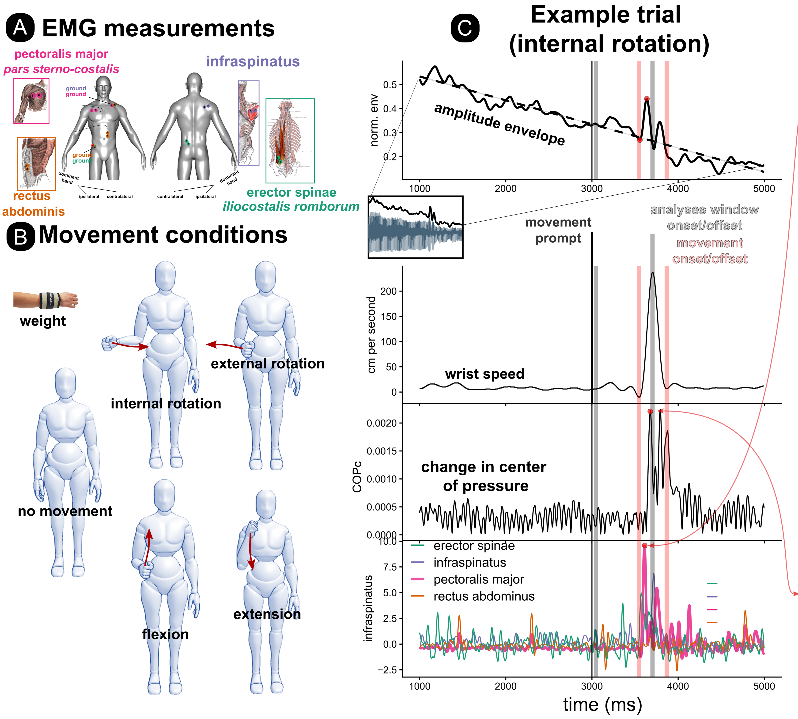

# The Human Voice and Whole-Body Kinetics Open Dataset
This repository contains the open data overview and analyses code for the project by Pouw, Werner, Burchardt, Selen, 'The human voice aligns with whole-body kinetics' to appear in *Proceedings of the Royal Society B: Biological Sciences*. Note that below other associated publications are listed, and will be maintained for any future publications (please reach out if your study makes use of this data when published).

<div align="center">
  
  <br>
  <em>Graphical Overview of Experimental Setup</em>
</div>

## 📊 Notebook
View our analysis notebook online: [https://wimpouw.github.io/kineticsvoice/](https://wimpouw.github.io/kineticsvoice/)

## 📁 Repository Structure

- **dataset**: Contains a link to the Donders Repository where the full dataset can be downloaded, including:
  - Tracked videos
  - Audio files
  - Time series for balance board and EMG
  - Acoustic measurements

To go directly to the citable dataset download page: https://doi.org/10.34973/p9se-mq71

- **docs**: Contains HTML pages, such as the knitted R Markdown file

- **RMarkdown**: Contains the R Markdown script for generating the supporting information

- **pre_registration_copy**: Contains a timestamped copy of the pre-registration (with redacted names), for the unredacted version on OSF see here: https://osf.io/jhdq4

## 🔄 Reproducibility
Should you have any issues with package version compatability or reproducing the exact results, for this project we have also used `renv` to ensure computational reproducibility. To reproduce our exact analysis environment:

1. **Clone this repository**:
   ```
   git clone https://github.com/wimpouw/kineticsvoice.git
   cd kineticsvoice
   ```

2. **Install renv** (if not already installed):
   ```r
   install.packages("renv")
   ```

3. **Restore the environment** from our lockfile (this can be for example run in the console when opening the notebook):
   ```r
   renv::restore()
   ```
   This will install all packages at the exact versions we used.

### Additional Reproducibility Files

- `session_info_kinetics.txt`: Contains detailed information about the R session and packages (for manual checking mostly)
- `renv.lock`: Records the exact package versions that are machine-readable and easy to reuse

## 📊 Open Data
Access the complete large data files at the Radboud Data Repository
* DOI: https://doi.org/10.34973/p9se-mq71
* Location: https://data.ru.nl/collections/di/dcc/DSC_2023.00002_259

## Associated publications
* Pouw, W., Werner, R., Burchardt, L. S., & Selen, L. P. (2025). The human voice aligns with whole-body kinetics. Proceedings B, 292(2047), 20250160. [https://doi.org/10.1098/rspb.2025.0160](https://doi.org/10.1098/rspb.2025.0160).
* Pouw, W., Burchardt, L. S., Werner, R. J., & Selen, L. P. J. (2024). Movement-related muscle activity and kinetics affect human vocalization amplitude. In *Proceedings of the International Conference on the Evolution of Language (EVOLANG2024)*, Madison, USA.
* Werner, R., Selen, L., & Pouw, W. (2024). Arm movements increase acoustic markers of expiratory flow. In *Proceedings of Speech Prosody 2024*, Leiden, The Netherlands.
* Hafkamp, M. S., Werner, R., Drijvers, L., Selen, L., & Pouw, W. (2025). Dissociating Mechanisms of Heart-Voice Coupling. bioRxiv, 2025-12.

## 📧 Contact
For questions or collaborations, please contact: w.pouw@tilbuguniversity.edu or go to www.wimpouw.com